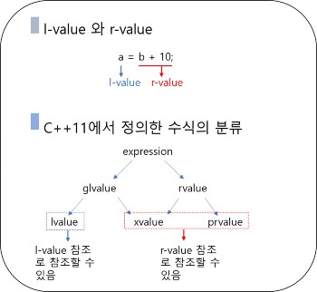

[<< BACK](https://github.com/dlalstj0213/CppStart)

---

# 📖 클래스와 객체 (2)
- [📖 클래스와 객체 (2)](#-클래스와-객체-2)
  - [디폴트 생성자](#디폴트-생성자)
  - [복사 생성자](#복사-생성자)
  - [이동 생성자](#이동-생성자)
  - [static 데이터 멤버와 static 멤버함수](#static-데이터-멤버와-static-멤버함수)


## 디폴트 생성자
- ✅ **디폴트 생성자(default constructor)란?**
  - 매개변수가 없는 생성자, 또는 모든 매개변수에 디폴트 인수가 지정된 생성자
  - 클래스를 선언할 때 생성자를 선언하지 않으면 컴파일러는 묵시적으로 디폴트 생성자를 정의함
    - 묵시적 디폴트 생성자는 아무런 처리도 포함하지 않음
  - 생성자를 하나라도 선언하면 컴파일러는 묵시적 디폴트 생성자를 정의하지 않음

- ✅ **묵시적 디폴트 생성자**
    ```c++
    class Counter{
        int value;
        public:
           // Counter(){} 묵시적 디폴트 생성자,
           // 생성자를 정의하지 않으면 자동으로 묵시적 디폴트 생성자를 컴파일러가 생성함
            void reset(){......}
            ......
    };

    int main(){
        Counter cnt;    // OK
    }
    ```
- ✅ **디폴트 생성자가 없는 클래스**
    ```c++
    class CounterM{
        const int maxValue;
        int value;
        public:
            CounterM(int mVal) : maxValue{mVal}, value{0} {}
            // 이렇게 많은 데이터 멤버의 초기값을 선언할때에는 , 로 나열 가능 (','= 초기화 리스트)
            void reset(){
                value = 0;
            }
            void count(){
                value = value < maxValue ? value + 1 : 0;
            }
            ......
    };

    int main(){
        CounterM cnt1(999); // OK
        CounterM cnt2();    // ERROR
    }
    ```
- ✅ **객체 배열의 선언**
    - 디폴트 생성자가 있을 경우
    ```c++
    class Counter{
        int value;
        public:
           // Counter(){} 묵시적 디폴트 생성자,
            void reset(){......}
            ......
    };

    int main(){
        Counter cntArr[4];  // OK
        Counter *pt = new Counter[10];  // OK
    }  
    ```
    - 디폴트 생성자가 없을 경우
    ```c++
    class CounterM{
        const int maxValue;
        int value;
        public:
            CounterM(int mVal) : maxValue{mVal}, value{0} {}
            ......
    };

    int main(){
        CounterM cntMArr1[3];   // ERROR
        CounterM cntMArr2[3] = {CounterM(9), CounterM(99), CounterM(999)};   // OK
        CounterM *pt = new CounterM[10];    // ERROR
    }
    ```


## 복사 생성자
- ✅ **복사 생성자(copy constructor)란?**
  - 같은 클래스의 객체를 복사하여 객체를 만드는 생성자
  - 묵시적 복사 생성자: 객체의 데이터 멤버들을 그대로 복사하여 객체를 만들도록 묵시적으로 정의된 복사 생성자

- ✅ **명시적으로 복사 생성자를 정의하는 형식**
    ```c++
    class ClassName{
        ......
        public:
            ClassName(const ClassName& obj){    // 반드시 참조형으로 받음 &
                ......  // 생성되는 객체에 obj를 복사하는 처리
            }
    };
    ```
- ✅ **묵시적 복사 생성자**
    ```c++
    class CounterM{
        const int maxValue;
        int value;
        public:
            CounterM(int mVal)
            : maxValue{mVal}, value{0} {}
            /*
            CounterM(const CounterM& c)
            : maxValue{c.maxValue}, value{c.value} {}
            // 묵시적 복사 생성자
            */
            ......
    };

    int main(){
        CounterM cnt1(99);
        CounterM cnt2(cnt1);
        CounterM cnt3 = cnt1;
    }
    ```

- ✅ **얕은 복사의 문제점 - VecF 클래스**
    |VecF 클래스|
    |---|
    |벡터 객체를 만들 수 있는 VecF 클래스를 정의하고자 한다.<br>VecF 객체는 저장할 수 있는 float 값의 수를 인수로 지정하여 생성되며,<br>저장할 값의 배열이 제공될 경우 그 값으로 초기화한다.<br>인수로 전달된 VecF 객체와 덧셈한 결과를 반환할 수 있으며,<br>객체에 저장된 벡터를 출력할 수 있다.|
    
    |메소드|비고|
    |---|---|
    |`VecF(int d, float* a)`|생성자|
    |`~VecF()`|소멸자|
    |`VecF add(const VecF& fv)`|fv와 덧셈을 한 결과를 반환함|
    |`void print()`|벡터를 출력함|

    |속성|비고|
    |---|---|
    |`int n`|벡터의 크기를 저장함|
    |`float *arr`|벡터의 저장공간 포인터|

  - VecF.h

    ```c++
    #include <iostream>
    #include <cstring>
    using namespace std;

    class VecF{
        int n;
        float *arr;
        public:
            VecF(int d, const float* a=nullptr) : n{d}{
                arr = new float[d];
                if(a) memcpy(arr, a, sizeof(float) * n);
                // memcpy(목적지, 복사 소스, 복사할 바이트 수): 데이터 복사 함수
            }

            ~VecF(){
                delete[] arr;
            }

            VecF add(const VecF& fv) const{
                VecF tmp(n);    // 벡터의 덧셈 결과를 저장할 임시 객체
                for(int i=0; i<n; i++)
                    tmp.arr[i] = arr[i] + fv.arr[i];
                return tmp; // 덧셈 결과를 반환
            }

            void print() const{
                cout << "[ ";
                for(int i=0; i<n; i++)
                    cout << arr[i] << " ";
                cout << "]";
            }
    };
    ```
  - VFMain1.cpp

    ```c++
    #include <iostream>
    using namespace std;
    #include "VecF.h"
    
    int main(){
        float a[3] = {1,2,3};
        VecF v1(3, a);  // 1,2,3을 저장하는 벡터
        VecF v2(v1);    // v1을 복사하여 v2를 만듦
        // VecF v2(v1); 은 얕은 복사(shallow copy)를 한 것이다.
        // 별개의 객체가 아니라 v1, v2가 같은 데이터를 공유하고 있다는 의미이다.
        v1.print(); // [ 1 2 3 ]
        cout << endl;
        v2.print(); // [ 1 2 3 ]
        cout << endl;
        return 0;
    }
    /*
    - 얕은 복사의 문제
    main이 끝나면서 v1의 소멸자가 동작 후에 v2의 소멸자가 동작되는데
    이러한 소멸자 동작 중 v2의 소멸자는
    이미 소멸된 공간을 또 소멸시키려는 delete[] arr이 실행되기 때문에
    ERROR가 발생한다.
    -> 얕은 복사가 아니고 두개의 객체가 완전히 별개로 분리되게끔 완전한 복사가 이루어져야 한다.
    */
    ```
  - VecF.h (수정 -1)
    ```c++
    #include <iostream>
    #include <cstring>
    using namespace std;

    class VecF{
        int n;
        float *arr;
        public:
            VecF(int d, const float* a=nullptr) : n{d}{
                arr = new float[d];
                if(a) memcpy(arr, a, sizeof(float) * n);
            }

            // 복사 생성자 추가
            VecF(const VecF& fv) : n{fv.n} {
                arr = new float[n];
                memcpy(arr, fv.arr, sizeof(float) * n);
                // memcpy(목적지, 복사 소스, 복사할 바이트 수): 데이터 복사 함수
            }

            ~VecF(){
                delete[] arr;
            }

            VecF add(const VecF& fv) const{
                VecF tmp(n);    // 벡터의 덧셈 결과를 저장할 임시 객체
                for(int i=0; i<n; i++)
                    tmp.arr[i] = arr[i] + fv.arr[i];
                return tmp; // 덧셈 결과를 반환
            }

            void print() const{
                cout << "[ ";
                for(int i=0; i<n; i++)
                    cout << arr[i] << " ";
                cout << "]";
            }
    };
    ```


## 이동 생성자
- ✅ 불필요한 복사의 비효율성
    - r-value 참조를 이용해 이동 생성자로 효율 개선이 가능

- ✅ l-value와 r-value

    <br>

- ✅ r-value 참조의 선언
  - `&`기호로 선언하는 l-value 참조와는 달리 r-value 참조는 `&&`기호로 선언함
  - ex)
    ```c++
    // l-value 참조
    VeF v1(3), v2(3);   
    VecF& vLRef = v1;   // l-value 참조로 l-value를 참조함
    int& a = 10;    // ERROR: l-value 참조로 r-value를 참조할 수 없음
    const int& b = 20;  // 상수 l-value 참조로는 r-value를 참조할 수 있음
    
    // r-value 참조
    int&& c = 30;   // r-value는 r-value 참조로 참조할 수 있음
    VecF&& vRRef1 = v1.add(v2); // 함수의 반환 객체는 r-value임
    VecF&& vRRef2 = v2; // ERROR: r-value 참조로 l-value를 참조할 수 없음
    ```

- ✅ 이동 생성자(move constructor)란?
  - r-value 참조로 전달된 같은 클래스의 객체의 내용을 이동하여 객체를 만드는 생성자

- ✅ 이동 생성자의 선언 형식
    ```c++
    class ClassName{
        ......
        public:
            // 이동 생성자
            ClassName(ClassName&& obj){ // const 선언 X
                ......  // 생성되는 객체에 obj의 내용을 이동하는 처리
            }
            ......
    }
    ```

  - VecF.h (수정 -2)

    ```c++
    #include <iostream>
    #include <cstring>
    using namespace std;

    class VecF{
        int n;
        float *arr;
        public:
            VecF(int d, const float* a=nullptr) : n{d}{
                arr = new float[d];
                if(a) memcpy(arr, a, sizeof(float) * n);
            }

            // 복사 생성자
            VecF(const VecF& fv) : n{fv.n} {
                arr = new float[n];
                memcpy(arr, fv.arr, sizeof(float) * n);
                // memcpy(목적지, 복사 소스, 복사할 바이트 수): 데이터 복사 함수
            }

            // 이동 생성자
            VecF(VecF&& fv) : n{fv.n}, arr{fv.arr} {
                // <중요> fv는 아무것도 가지지 않게 정의해줘야 함
                fv.arr = nullptr;
                fv.n = 0;
            }           

            ~VecF(){
                // delete[] arr 이 nullptr 일 경우 아무런 처리하지 않고 그냥 return 함. (ERROR X)
                delete[] arr;
            }

            VecF add(const VecF& fv) const{
                VecF tmp(n);    // 벡터의 덧셈 결과를 저장할 임시 객체
                for(int i=0; i<n; i++)
                    tmp.arr[i] = arr[i] + fv.arr[i];
                return tmp; // 덧셈 결과를 반환
            }

            void print() const{
                cout << "[ ";
                for(int i=0; i<n; i++)
                    cout << arr[i] << " ";
                cout << "]";
            }
    };
    ```

## static 데이터 멤버와 static 멤버함수
- ✅ **static 데이터 멤버**
  - 클래스에 속하는 모든 객체들이 **공유**하는 데이터 멤버
  - 객체 생성과 관계 없이 프로그램이 시작되면 **static  데이터 멤버를 위한 메모리 공간**이 할당됨
  - 일반 데이터 멤버와는 달리, static 데이터 멤버는 클래스 선언문 내에서는 선언만 하고 클래스 외부에서 별도로 정의해야 함

- ✅ **static 멤버함수**
  - 특정 객체에 대한 처리를 하는 것이 아니라, 소속 클래스 단위의 작업을 수행하는 함수
  - static 멤버함수는 객체가 정의되지 않아도 사용할 수 있음
  - static 멤버함수 안에서는 **일반멤버를 사용할 수 없으며**, **static멤버만 사용**할 수 있음

- ✅ **static 활용 - NamedObj 클래스**
    |NamedObj 클래스|
    |---|
    |이름을 갖는 객체를 만들 수 있는 클래스를 정의하고자 한다.<br>객체가 생성될 때 고유번호를 가지게 되는데,<br>이 번호는 NamedObj 객체가 생성됨에 따라 1번부터 시작하여 차례로 부여되는 일련번호이다.<br>객체는 자기 자신의 일련번호와 이름을 출력할 수 있으며,<br>현재 존재하는 NamedObj 클래스의 객체 수를 구할 수있다.|

    |메소드|비고|
    |---|---|
    |`NamedObj(const char *s)`|생성자 -이름을 s로 초기화 함|
    |`~NamedObj()`|소멸자|
    |`void display()`|ID와 이름을 출력함|
    |`static int nobj`|현재 존재하는 객체의 수를 구함|

    |속성|비고|
    |---|---|
    |`char *name`|이름을 저장함|
    |`int id`|ID 번호를 저장함|
    |`static int nConstr`|생성된 객체의 수|
    |`static int nDestr`|소멸된 객체의 수|

  - NamedObj.h
    
    ```c++
    class NamedObj{
        char *name;
        int id;
        // static 데이터 멤버
        static int nConstr; // 생성된 객체 수
        static int nDestr;  // 소멸된 객체 수
        public:
            NamedObj(const char *s);    // 생성자
            ~NamedObj();    // 소멸자
            void display() const{   // 객체의 속성 출력
                cout << "ID : " << id << " --> 이름 : "<< name << endl;
            }
            static int nObj(){  // 존재하는 객체 수 반환
                return nConstr = nDestr;
            }
    };
    ```

  - NamedObj.cpp
    ```c++
    #include <cstring>
    #include "NamedObj.h"

    NamedObj::NamedObj(const char *s){
        name = new char[strlen(s)+1];   // 문자열을 복사할 공간을 할당
        strcpy(name, s);
        id = ++nConstr; // 생성된 객체의 수를 증가시키고 이를 ID로 부여
    }

    NameObj::~NamedObj(){
        ++nDestr;   // 소멸된 객체의 수를 증가시킴
        delete[] name;
    }

    // static 데이터 멤버의 정의 및 초기화
    int NamedObj::nConstr = 0;
    int NamedObj::nDestr = 0;
    // <중요> static 데이터 멤버는 class 선언문 안에서 선언만 해놓고 외부에 별도로 정의한다.

    void f(){
        NamedObj x("Third");    // 세 번째 객체의 생성
        x.display();    // 함수 반환 후 x는 소멸됨
    }

    int main(){
        cout << "NamedObj 클래스의 객체 수 : " 
            << NamedObj::nObj() << endl;    // 0 출력
        NamedObj a("First");    // 첫 번째 객체 생성
        NamedObj b("Second");   // 두 번째 객체 생성
        f();
        NamedObj c("Fourth");   // 네 번째 객체 생성
        c.display();
        cout << "NamedObj 클래스의 객체 수 : " 
            << NamedObj::nObj() << endl;    // 0 출력
        return 0;
    }
    ```
---

[^TOP](#)

---