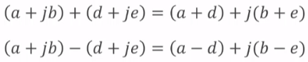
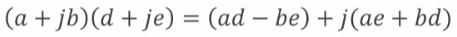
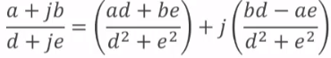

[⏪BACK](https://github.com/dlalstj0213/CppStart)

---

# 📖 클래스와 객체 (3)

- [📖 클래스와 객체 (3)](#-클래스와-객체-3)
  - [스택 클래스 - CharStack](#스택-클래스---charstack)
  - [복소수 클래스 - Complex1](#복소수-클래스---complex1)
  - [심화 학습](#심화-학습)

## 스택 클래스 - CharStack
- ✅ **스택(stack)이란?**
  - 데이터를 저장하는 자료구조의 하나
  - 스택의 기본 연산
    - push: 데이터를 저장하는 연산
    - pop: 마지막으로 저장한 데이터를 인출하는 연산
    - **LIFO** (Last In, First Out)

- ✅ **CharStack 클래스**

    |CharStack 클래스|
    |---|
    |문자를 최대 20개까지 저장할 수 있는 스택을 나타내는 클래스를 선언하라.<br>스택 객체는 데이터를 저장(push)하거나 인출(pop)할 수 있으며,<br>스택이 비어있는지 가득 차 있는지 검사할 수 있다.<br>또한 이 스택을 이용하여 입력된 단어를 역순으로 출력하는 프로그램을 작성하라.|

    |멤버함수|비고|
    |---|---|
    |`charStack()`|생성자|
    |`bool chkEmpty()`|스택이 비어 있는지 검사함|
    |`bool chkFull`|스택이 가득 차 있는지 검사함|
    |`bool push(char)`|스택에 데이터를 저장함|
    |`char pop()`|스택에서 데이터를 꺼냄|

    |데이터 멤버|비고|
    |---|---|
    |`int top`|가장 위에 있는 데이터 위치를 가리킴|
    |`char buf[20]`|데이터 저장 공간|

  - CharStack.h

    ```c++
    class CharStack{
        enum {size = 20};   // 스택의 크기
        int top;    // 마지막 데이터를 가리키는 포인터
        char buf[size]; // 스택의 저장공간

        public:
            CharStack() : top{size} {}  // 생성자
            bool chkEmpty() const {    // 스택에 데이터가 없으면 true
                return top == size;
            }
            bool chkFull const {    // 스택이 가득 차 있다면 true
                return !top;
            }
            bool push(char ch); // 스택에 데이터를 넣음
            char pop(); // 스택에서 데이터를 꺼냄
    };
    ```

  - CharStack.cpp

    ```c++
    #include <iostream>
    #include "CharStack.h"
    using namespace std;

    bool CharStack::push(char ch){
        if(chkFull()){
            cout << "스택이 가득 차 있습니다." << endl;
            return false;
        }
        buf[--top] = ch;    // 스택 공간이 있으면 저장
        return true;
    }
    char CharStack::pop(){
        if(chkEmpty()){
            cout << "스택에 데이터가 없습니다." << endl;
            return 0;
        }
        return buf[top++];  // top 위치의 데이터 반환
    }
    ```

  - CSMain.cpp

    ```c++
    #include <iostream>
    #include "CharStack.h"
    using namespace std;

    int main(){
        CharStack chStack;
        char str[20];   // 20개의 문자를 저장할 수 있는 스택
        ......
        char* pt = str; // 포인터로 문자열 시작 위치를 가리킴
        while(*pt)  // 문자열의 끝이 아니면 반복
            chStack.push(*(pt++));  // 스택에 문자를 넣음
        cout << "역순 단어 출력: ";
        while(~chStack.chkEmpty())  // 스택이 비어 있지 않으면 반복
            cout << chStack.pop();  // 스택에서 인출한 문자를 출력
        cout << endl;
        return 0;
    }
    ```

## 복소수 클래스 - Complex1
- ✅ **복소수(complex number)란?**
  - 실수부와 허수부로 구성되는 수
  - 복소수의 표현: a + jb
    - a: 실수부의 값
    - b: 허수부의 값
    - j는 허수 단위로서, j^2 = -1 임
  - 켤레복소수(complex conjugate)
    - 허수부의 부호가 반대인 복소수
    - a + jb 의 켤레복소수는 a - jb 임

- ✅ **복소수 연산**
  - 덧셈(뺄셈): 실수부의 합(차)과 허수부의 합(차)을 각각 구함
    - 
  - 곱셈
    - 
  - 나눗셈
    - 

- ✅ **Complex1 클래스**

    |Complex1 클래스|
    |---|
    |복소수를 표현하는 클래스를 선언하라.<br>복소수의 사칙연산 및 켤레복소수를 구하는 멤버함수를 포함하며,<br>실수부의 값이 a, 허수부의 값이 b일 때<br>(a+jb) 형태로 출력할 수 있도록 한다.|

    |멤버함수|비고|
    |---|---|
    |`Complex1(double r, double i)`|생성자|
    |`Complex1 conj()`|켤레복소수 반환|
    |`Complex1 add(const Complex1& c)`|덧셈|
    |`Complex1 sub(const Complex1& c)`|뺄셈|
    |`Complex1 mul(const Complex1& c)`|곱셈|
    |`Complex1 div(const Complex1& c)`|나눗셈|
    |`void display()`|복소수의 값 출력|

    |데이터 멤버|비고|
    |---|---|
    |`double rPart`|실수부의 값|
    |`double iPart`|허수부의 값|

  - Complex1.h

    ```c++
    class Complex1{
        double rPart, iPart;    // 실수부 및 허수부
        public:
            Complex1(double r=0, double i = 0): rPart(r), iPart(i) {}   // 생성자
            Complex conj() const {
                return Complex1(rPart, -iPart);
            }
            Complex add(const Complex1& c) const {
                return Complex1(rPart + c.rPart, iPart + c.iPart);
            }
            Complex sub(const Complex1& c) const {
                return Complex1(rPart - c.Part, iPart - c.iPart);
            }
            Complex1 sub(const Complex1& c);
            Complex1 div(const Complex1& c);
            void display(); // 복소수 값을 출력
    };
    ```

  - Complex1.cpp

    ```c++
    #include <iostream>
    #include "Complex1.h"
    using namespace std;

    Complex1 Complex1::mul(const Complex1& c) const {
        double r = rPart * c.rPart - iPart * c.iPart;
        double i = rPart * c.iPart + iPart * c.rPart;
        return Complex(r, i);
    }
    Complex1 Complex1::div(const Complex1& c) const {
        double d = c.rPart * c.rPart + c.iPart * c.iPart;
        Complex 1 c1 = mul(c.conj());
        return Complex(c1.rPart/d, c1.iPart/d);
    }
    void display(){
        cout << "(" << rPart;
        if(iPart > 0) cout << "+j" << iPart;
        else if(iPart < 0) cout << "-j" << -iPart;
        cout << ")";
    }
    ```
  - C1Main.cpp

    ```c++
    #include <iostream>
    #include "Complex1.h"
    using namespace std;

    int main(){
        Complex1 c1(1, 2);
        Complex1 c2(2, 3);
        Complex c3 = c1.add(c2);
        c1.display();
        cout << " + ";
        c2.display();
        cout << " = ";
        c3.display();
        cout << endl;

        c3 = c1.mul(10.0);
        c1.display();
        cout << " * 10 = ";
        c3.display();
        cout << endl;
        return 0;
    }

    ```


## 심화 학습
- ✅ **위임 생성자(delegating constructor)의 선언 (C++ 이후)**
  - 초기화 리스트에 앞서 선언된 생성자를 사용하여 새로운 생성자를 선언할 수 있음
    - 위임 생성자: 앞서 선언된 생성자를 이용하여 선언되는 생성자
    - 타겟 생성자: 위임의 대상이 되는 생성자
  - 생성자를 작성하는 코드의 중복을 줄일 수 있음
  
  - Vef.h 의 위임 생성자 적용
      ```c++
      // 위임 생성자 X
      class VecF{
          int n;
          float *arr;
          public:
              VecF(int d, const float* a=nullptr) : n{d}{
                  arr = new float[d];
                  if(a) memcpy(arr, a, sizeof(float) * n);
              }
              // 복사 생성자 추가
              VecF(const VecF& fv) : n{fv.n} {
                  arr = new float[n];
                  memcpy(arr, fv.arr, sizeof(float) * n);
              }
              ......
      };

      // 위임 생성자 O
      class VecF{
          int n;
          float *arr;
          public:
              VecF(int d, const float* a=nullptr) : n{d}{
                  arr = new float[d];
                  if(a) memcpy(arr, a, sizeof(float) * n);
              }
              // 위임 생성자
              VecF(const VecF& fv) : VecF(fv.n, fv.arr) {}
              ......
      };
      ```

- ✅ **초기화 리스트 생성자(initializer-list constructor)란?**
  - 첫 번째 매개변수가 std::initializer_list<Type> 인 생성자
  - std::initializer_list 클래스
    - 지정된 자료형의 값들을 `{}` 안에 나열한 리스트
    - 헤더 파일: `include <initializer_list>`
        |멤버함수|용도|
        |---|---|
        |`begin()`|첫 번째 요소에 대한 포인터를 반환함|
        |`end()`|마지막 요소의 다음 위치에 대한 포인터를 반환함|
        |`size()`|initialize_list의 원소 수를 반환함|
        - ex) `initializer_list<int> ilst{1, 2, 3};`
  - 초기화 리스트 생성자 활용

    ```c++
      class VecF{
          int n;
          float *arr;
          public:
              VecF(int d, const float* a=nullptr) : n{d}{
                  arr = new float[d];
                  if(a) memcpy(arr, a, sizeof(float) * n);
              }
              // 초기화 리스트 생성자
              VecF(initializer_list<float> lst) : n{static_cast<int>(lst.size())} {
                  arr = new float[n];
                  copy(lst.begin(), lst.end(), arr);
              }
              ......
      };

      int main(){
          float a[4] = {1.0f, 2.0f, 3.0f, 4.0f};
          VecF v1(4, a);
          VecF v2(2.0f, 4.0f, 6.0f, 8.0f); // 초기화 리스트 생성자를 활용한 객체 생성
      }
    ```


---

[⏫TOP](#)

---